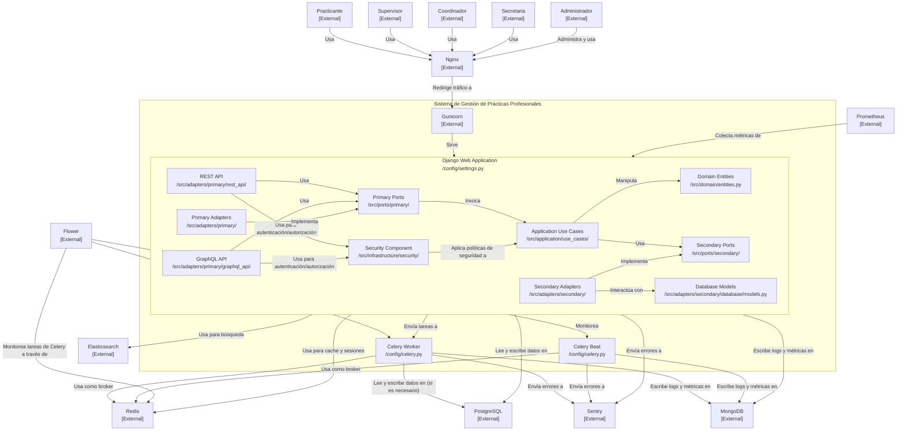

# Unnamed CodeViz Diagram

```mermaid
graph TD

    practicante["Practicante<br>[External]"]
    supervisor["Supervisor<br>[External]"]
    coordinador["Coordinador<br>[External]"]
    secretaria["Secretaria<br>[External]"]
    administrador["Administrador<br>[External]"]
    postgresql["PostgreSQL<br>[External]"]
    redis["Redis<br>[External]"]
    elasticsearch["Elasticsearch<br>[External]"]
    sentry["Sentry<br>[External]"]
    flower["Flower<br>[External]"]
    prometheus["Prometheus<br>[External]"]
    nginx["Nginx<br>[External]"]
    mongodb["MongoDB<br>[External]"]
    subgraph DJGRedisPA["Sistema de Gestión de Prácticas Profesionales<br>/README.md"]
        celery_worker["Celery Worker<br>/config/celery.py"]
        celery_beat["Celery Beat<br>/config/celery.py"]
        gunicorn["Gunicorn<br>[External]"]
        subgraph django_app["Django Web Application<br>/config/settings.py"]
            rest_api["REST API<br>/src/adapters/primary/rest_api/"]
            graphql_api["GraphQL API<br>/src/adapters/primary/graphql_api/"]
            application_use_cases["Application Use Cases<br>/src/application/use_cases/"]
            domain_entities["Domain Entities<br>/src/domain/entities.py"]
            primary_ports["Primary Ports<br>/src/ports/primary/"]
            secondary_ports["Secondary Ports<br>/src/ports/secondary/"]
            primary_adapters["Primary Adapters<br>/src/adapters/primary/"]
            secondary_adapters["Secondary Adapters<br>/src/adapters/secondary/"]
            security_component["Security Component<br>/src/infrastructure/security/"]
            database_models["Database Models<br>/src/adapters/secondary/database/models.py"]
            %% Edges at this level (grouped by source)
            rest_api["REST API<br>/src/adapters/primary/rest_api/"] -->|"Usa"| primary_ports["Primary Ports<br>/src/ports/primary/"]
            rest_api["REST API<br>/src/adapters/primary/rest_api/"] -->|"Usa para autenticación/autorización"| security_component["Security Component<br>/src/infrastructure/security/"]
            graphql_api["GraphQL API<br>/src/adapters/primary/graphql_api/"] -->|"Usa"| primary_ports["Primary Ports<br>/src/ports/primary/"]
            graphql_api["GraphQL API<br>/src/adapters/primary/graphql_api/"] -->|"Usa para autenticación/autorización"| security_component["Security Component<br>/src/infrastructure/security/"]
            primary_adapters["Primary Adapters<br>/src/adapters/primary/"] -->|"Implementa"| primary_ports["Primary Ports<br>/src/ports/primary/"]
            primary_ports["Primary Ports<br>/src/ports/primary/"] -->|"Invoca"| application_use_cases["Application Use Cases<br>/src/application/use_cases/"]
            application_use_cases["Application Use Cases<br>/src/application/use_cases/"] -->|"Manipula"| domain_entities["Domain Entities<br>/src/domain/entities.py"]
            application_use_cases["Application Use Cases<br>/src/application/use_cases/"] -->|"Usa"| secondary_ports["Secondary Ports<br>/src/ports/secondary/"]
            secondary_adapters["Secondary Adapters<br>/src/adapters/secondary/"] -->|"Implementa"| secondary_ports["Secondary Ports<br>/src/ports/secondary/"]
            secondary_adapters["Secondary Adapters<br>/src/adapters/secondary/"] -->|"Interactúa con"| database_models["Database Models<br>/src/adapters/secondary/database/models.py"]
            security_component["Security Component<br>/src/infrastructure/security/"] -->|"Aplica políticas de seguridad a"| application_use_cases["Application Use Cases<br>/src/application/use_cases/"]
        end
        %% Edges at this level (grouped by source)
        gunicorn["Gunicorn<br>[External]"] -->|"Sirve"| django_app["Django Web Application<br>/config/settings.py"]
        django_app["Django Web Application<br>/config/settings.py"] -->|"Envía tareas a"| celery_worker["Celery Worker<br>/config/celery.py"]
    end
    %% Edges at this level (grouped by source)
    practicante["Practicante<br>[External]"] -->|"Usa"| nginx["Nginx<br>[External]"]
    supervisor["Supervisor<br>[External]"] -->|"Usa"| nginx["Nginx<br>[External]"]
    coordinador["Coordinador<br>[External]"] -->|"Usa"| nginx["Nginx<br>[External]"]
    secretaria["Secretaria<br>[External]"] -->|"Usa"| nginx["Nginx<br>[External]"]
    administrador["Administrador<br>[External]"] -->|"Administra y usa"| nginx["Nginx<br>[External]"]
    nginx["Nginx<br>[External]"] -->|"Redirige tráfico a"| gunicorn["Gunicorn<br>[External]"]
    django_app["Django Web Application<br>/config/settings.py"] -->|"Lee y escribe datos en"| postgresql["PostgreSQL<br>[External]"]
    django_app["Django Web Application<br>/config/settings.py"] -->|"Usa para cache y sesiones"| redis["Redis<br>[External]"]
    django_app["Django Web Application<br>/config/settings.py"] -->|"Usa para búsqueda"| elasticsearch["Elasticsearch<br>[External]"]
    django_app["Django Web Application<br>/config/settings.py"] -->|"Envía errores a"| sentry["Sentry<br>[External]"]
    django_app["Django Web Application<br>/config/settings.py"] -->|"Escribe logs y métricas en"| mongodb["MongoDB<br>[External]"]
    celery_worker["Celery Worker<br>/config/celery.py"] -->|"Usa como broker"| redis["Redis<br>[External]"]
    celery_worker["Celery Worker<br>/config/celery.py"] -->|"Lee y escribe datos en (si es necesario)"| postgresql["PostgreSQL<br>[External]"]
    celery_worker["Celery Worker<br>/config/celery.py"] -->|"Envía errores a"| sentry["Sentry<br>[External]"]
    celery_worker["Celery Worker<br>/config/celery.py"] -->|"Escribe logs y métricas en"| mongodb["MongoDB<br>[External]"]
    celery_beat["Celery Beat<br>/config/celery.py"] -->|"Usa como broker"| redis["Redis<br>[External]"]
    celery_beat["Celery Beat<br>/config/celery.py"] -->|"Envía errores a"| sentry["Sentry<br>[External]"]
    celery_beat["Celery Beat<br>/config/celery.py"] -->|"Escribe logs y métricas en"| mongodb["MongoDB<br>[External]"]
    flower["Flower<br>[External]"] -->|"Monitorea tareas de Celery a través de"| redis["Redis<br>[External]"]
    flower["Flower<br>[External]"] -->|"Monitorea"| celery_worker["Celery Worker<br>/config/celery.py"]
    flower["Flower<br>[External]"] -->|"Monitorea"| celery_beat["Celery Beat<br>/config/celery.py"]
    prometheus["Prometheus<br>[External]"] -->|"Colecta métricas de"| django_app["Django Web Application<br>/config/settings.py"]

```
---
*Generated by [CodeViz.ai](https://codeviz.ai) on 10/12/2025, 3:12:21 PM*
